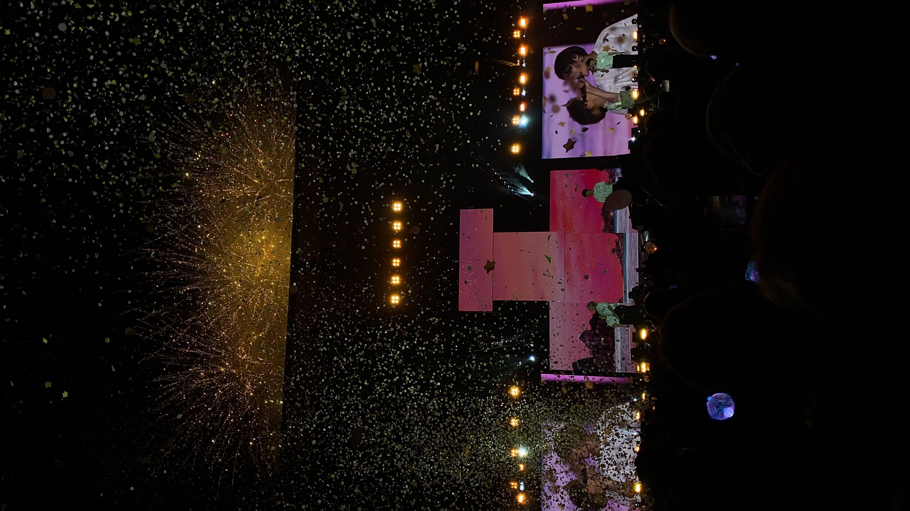
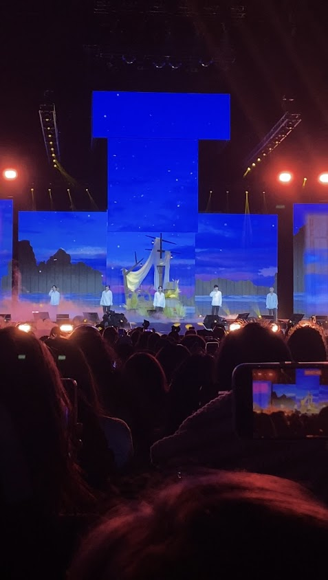
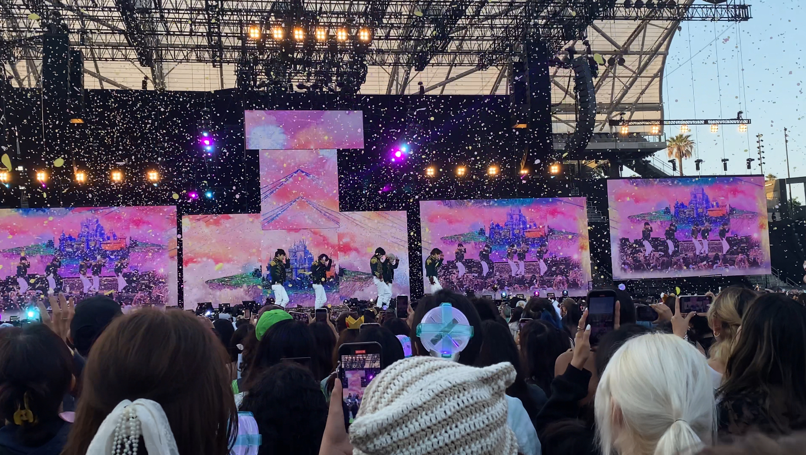
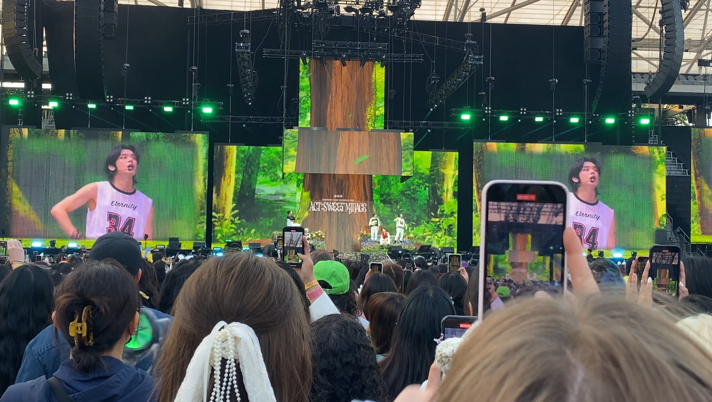

<!DOCTYPE html>
<html>
<head>
  <h1>ACT: SWEET MIRAGE Review</h1>

</head>
<body>
  <h2>ACT: SWEET MIRAGE</h2>
  
ACT: SWEET MIRAGE is Tomorrow X Together's Second World Tour centering around their latest album <em>The Name Chapter: Temptation</em>. The group performed 25 songs including an unreleased song, <em>Blue Spring</em>. I attended DAY 1 of ACT: SWEET MIRAGE in LA on May 27, 2023.

  <h2>Setlist Review</h2>

The setlist started with Blue Hour (Dance Break ver.). I was really excited because the year before at ACT: LOVESICK, they performed Blue Hour, but they didn't perform the Dance Break Version. I feel like the ACT: LOVESICK setlist was better than this setlist, but that one was hard to beat. I still loved the setlist this year. 

  <linebreak></linebreak>

Setlist Ranking

  <linebreak></linebreak>
  <ol>
<li>Farewell, Neverland</li>
<li>0X1=LOVESONG (I Know I Love You)</li>
<li>Blue Spring</li>
<li>Blue Hour</li>
<li>Drama</li>
<li>No Rules</li>
<li>0X1=LOVESONG (I Know I Love You)</li>
<li>9 and Three Quarters (Run Away)</li>
<li>We Lost The Summer</li>
<li>Cat & Dog (English ver.)</li>
<li>Can’t You See Me?</li>
<li>LO$ER=LO♡ER</li>
<li>Dear Sputnik</li>
<li>Opening Sequence</li>
<li>Anti-Romantic</li>
<li>Eternally</li>
<li>Good Boy Gone Bad</li>
<li>Tinnitus</li>
<li>Devil by the Window</li>
<li>Happy Fools</li>
<li>Sugar Rush Ride</li>
<li>Our Summer</li>
<li>Magic</li>
<li>Can’t We Just Leave The Monster Alive?</li>
<li>Angel or Devil</li>
<li>Ice Cream</li>
    <linbreak></linbreak>
  <h2>Performance Review</h2>

I think that TXT did such a great job that night. Throughout the night, their singing and dancing stayed consistent despite the concert being over 3 hours long. The use of confetti and fireworks added an extra boost of energy to the performances. 

    <linebreak></linebreak>
    
<h2>Favorite Performances</h2>

 My favorite performance of the night was "Farewell Neverland". It was also the performance that I was most excited to see. It's my favorite song from their new album, and it's one of if not my favorite b-side from their whole discography. The performance started with them singing the opening verse on a ship prop before dispersing across the main stage. Then, they walked down the stage to the extended stage before dancing to the melody of the song. The whole time I was watching this I was in awe. I watched this performance so many times online, and it was crazy for me to finally see it in person. I tried extra hard to make sure that my camera was steady, and I made sure to not sing along and just absorb the performance. 

<h2>Venue+Seat Review</h2>

BMO Stadium is a venue that holds up to 22,000 people. You do have to pay for the parking, so I was just dropped off with my friend. There are a good amount of food options at the venue. The stage is also pretty big, with really big screens. I sat in section B3, row 9, seat 5. This was the second section from the stage in the middle of the floor. In front of me there were about 6/7 seats rows in the first section closest to the stage, a gap between the two sections, then the start of my section. Initially, I was scared my seat would be too far away, and people would be too tall for me to see. However, my seat ended up being more than what I expected and they were really close when they came to the extended stage. However, I was also wearing really tall shoes that let me tower over the people in front of me, but that was at the cost of my feet burning and being really sore. When they were on the main stage it was harder to see them, but the screens were large enough to let you see the stage. 

    
(view of extended stage)

    
(view of main stage)

<h2>Final Review</h2>

ACT: SWEET MIRAGE Day 1 in LA was the best concert I've ever attended. I rate it a ∞/10.

<linebreak></linebreak>

TXT will be coming back with their new album <em>The Name Chapter: Freefalling</em> on October 13th, so make sure to give it a listen!

<linebreak></linebreak>
Click this link to give them a listen on Spotify! <a href="https://open.spotify.com/artist/0ghlgldX5Dd6720Q3qFyQB?si=hkWnZg78SROe6b9zW5N7fA">Listen Now</a>
</body>
</html>
